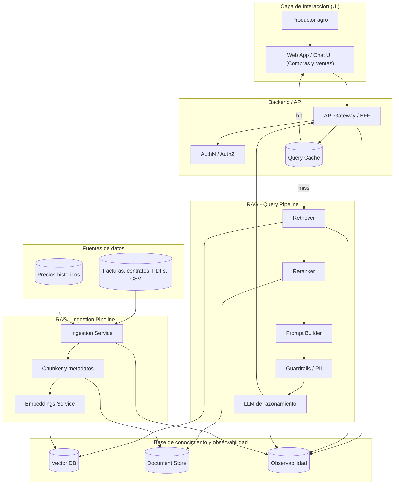

# EVERGREEN – Módulo Finanzas: Compras y Ventas (RAG)

## 1. Funcionalidad RAG
**Nombre de la Funcionalidad:** Asistente Inteligente de Compras y Ventas Agropecuarias  

---

### 1.1 Presentación de la Funcionalidad RAG
La funcionalidad consiste en un asistente financiero conversacional que permite a los productores agropecuarios consultar de forma natural sus operaciones de compras y ventas.  
Ejemplos de uso:  
- *“¿Cuánto gasté en fertilizantes este trimestre?”*  
- *“¿Cuál fue el cliente que más me compró café el último año?”*  
- *“¿Qué proveedores me ofrecen mejores precios de semillas?”*  

El objetivo es **centralizar información dispersa (facturas, contratos, reportes, precios históricos) y generar recomendaciones útiles** para optimizar la gestión financiera.

---

### 1.2 Esquema Explicativo de la Funcionalidad RAG
El esquema muestra cómo un productor puede consultar sus datos financieros en lenguaje natural. El sistema combina:  
- **Entradas:** documentos contables (facturas, contratos), reportes de ventas, bases de datos de precios del agro.  
- **Motor RAG:** que recupera y razona sobre la información relevante.  
- **Salidas:** respuestas financieras claras y recomendaciones.  

---

## 2. Elementos de Datos en la Funcionalidad RAG

### 2.1 Definición de la Base de Conocimiento
- Facturas de compras y ventas (PDF/Excel).  
- Contratos con proveedores y clientes.  
- Reportes históricos de precios de mercado.  
- Bases contables internas (cuentas por pagar/cobrar).  

### 2.2 Definición de Entradas
- Consultas en lenguaje natural de los usuarios.  
- Documentos cargados (facturas, contratos, recibos).  
- Datos estructurados de ERP/contabilidad.  

### 2.3 Definición de Salidas
- Respuestas en lenguaje natural sobre gastos, ingresos, clientes y proveedores.  
- Recomendaciones de optimización de compras y ventas.  
- Reportes automáticos de balances de compras y ventas.  

---

## 3. Propuesta de Arquitectura de la Solución
- **Front-end:** interfaz web / chatbot financiero.  
- **Back-end:** API que conecta el LLM con las fuentes de datos.  
- **Base de Conocimiento:** repositorio de documentos + embeddings vectoriales.  
- **Motor RAG:** pipeline de recuperación, enriquecimiento y generación.  

*(Aquí irá un diagrama UML o C4 mostrando flujo entre componentes: Usuario → Frontend → Backend → RAG Engine → Knowledge Base)*

---

## 4. Conclusiones del Caso de Aplicación
- El asistente RAG facilita la toma de decisiones en finanzas agro.  
- Reduce tiempos en la búsqueda de documentos y reportes.  
- Mejora la precisión al integrar datos estructurados y no estructurados.  
- Proyecta un escenario de digitalización financiera en el agro.  
